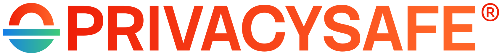

<p align="center">
  <a href="https://download.privacysafe.app"></a>
</p>
<h1 align="center">PrivacySafe Downloads</h1>

Source and deployment files for the official PrivacySafe software download host:
[download.privacysafe.app](https://download.privacysafe.app).

PrivacySafe is Free/Libre and Open Source Software (FLOSS) for private communication and
storage. PrivacySafe builds are published by [Ivy Cyber](https://ivycyber.com). Upstream
development, education, standards, and public-interest research are funded by donations to
[PrivacySafe Foundation](https://privacysafe.foundation), a 501(c)(3) nonprofit public charity.
The [download.privacysafe.app](https://download.privacysafe.app) site is hosted in Canada by
[3NSoft](https://3nsoft.com) for Ivy Cyber.

## Repository layout

```text
.
├── README.md
├── privacysafe_logo.svg
├── LICENSE
├── LICENSES/
│   └── AGPL-3.0-or-later.txt
├── NOTICE
├── TRADEMARKS.md
├── SECURITY.md
├── SPDX-HEADERS.md
├── CONTRIBUTING.md
├── docs/
│   ├── DEPLOYMENT.md
│   └── RELEASE-ALIASES.md
└── public/                         # web document root
    ├── index.html
    ├── robots.txt
    ├── sitemap.xml
    ├── llms.txt
    ├── weblabels.html
    ├── security.txt
    ├── .well-known/security.txt
    └── privacysafe-index/
        ├── autoindex.css
        ├── autoindex.js
        ├── favicon.ico
        ├── favicon.png
        ├── favicon.gif
        ├── header.html
        ├── footer.html
        ├── plausible-metrics.js
        ├── privacysafe_logo.svg
        ├── social-preview.jpg
        ├── stack-sans-headline-latin-400-normal.woff2
        ├── stack-sans-headline-latin-500-normal.woff2
        ├── stack-sans-headline-latin-600-normal.woff2
        └── stack-sans-headline-latin-700-normal.woff2
```

Use `public/` as the production document root for
[download.privacysafe.app](https://download.privacysafe.app). Release directories
(`latest/`, `test/`, and `nightly/`) are deployment data and do not belong in this
source repository unless the deployment workflow explicitly manages them here.

## Quick-download behavior

The existing production Nginx autoindex supplies the raw directory listing through
`privacysafe-index/header.html` and `privacysafe-index/footer.html`. No Nginx
configuration change is required for normal site deployments. `autoindex.js` transforms
that captured listing into the PrivacySafe directory UI and creates bold synthetic
quick-download rows at the top. The script searches versioned installer filenames, selects the newest build
for each installer family/architecture, and uses the selected file's actual date
and size.

The synthetic row is created regardless of whether a physical file or symlink
with the same clean alias name exists. Existing raw alias rows are suppressed so
a stale filesystem alias cannot override the directory UI.

See `docs/RELEASE-ALIASES.md` for optional filesystem symlinks and architecture
naming conventions.

## ⚖️ License

© 2026 <a href="https://ivycyber.com" rel="nofollow">Ivy Cyber LLC</a>. This project is dedicated to ethical <a href="https://fsf.org/" rel="nofollow">Free/Libre and Open Source Software (FLOSS)</a>.

Unless otherwise noted, this repository and the website it publishes—including HTML, CSS, JavaScript, text, images, and other original site materials—are Free/Libre and Open Source Software licensed under the <a href="https://www.gnu.org/licenses/agpl-3.0.html" rel="nofollow">GNU Affero General Public License version 3 or later</a> (`AGPL-3.0-or-later`).

PrivacySafe® and 3NWeb® are registered trademarks. PrivacySafe Foundation™ and Ivy Cyber™ are pending trademarks. Other product, service, technology, and organization names, logos, and marks used in connection with PrivacySafe, 3NWeb, PrivacySafe Foundation, Ivy Cyber, or 3NSoft may also be protected by applicable trademark law. Copyright and software licenses do not grant trademark rights or permission to use such marks in a manner that suggests sponsorship, endorsement, affiliation, or origin.

Third-party software, content, and documentation retain their original copyrights and licenses. See `NOTICE`, `LICENSES`, `TRADEMARKS.md`, and file-level SPDX identifiers for details. Stack Sans Headline is bundled as WOFF2 webfonts under the SIL Open Font License 1.1.

Per-script JavaScript licensing information for the download site is published at [download.privacysafe.app/weblabels.html](https://download.privacysafe.app/weblabels.html). The main PrivacySafe site maintains its own labels at [privacysafe.app/weblabels.html](https://privacysafe.app/weblabels.html).
